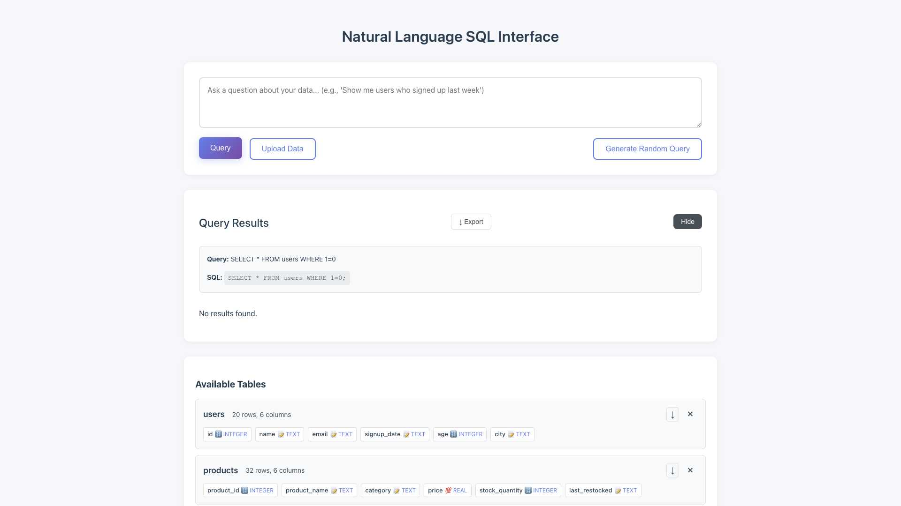

# One Click Table Exports

**ADW ID:** 490eb6b5
**Date:** 2025-07-24
**Specification:** specs/issue-14-adw-490eb6b5-sdlc_planner-one-click-exports.md

## Overview

This feature enables users to export table data and query results as CSV files with a single click. Download buttons are strategically placed next to existing UI controls, allowing users to export entire tables or current query results for use in external applications like Excel or data analysis tools.

## Screenshots




## What Was Built

- CSV export functionality for database tables
- CSV export functionality for query results
- Download buttons integrated into existing UI
- Server-side CSV generation using pandas
- Client-side file download handling
- Comprehensive unit tests for export utilities
- E2E tests for export functionality

## Technical Implementation

### Files Modified

- `app/server/core/export_utils.py`: New utility module for CSV generation with pandas
- `app/server/core/data_models.py`: Added ExportRequest and QueryExportRequest models
- `app/server/server.py`: Added /api/export/table and /api/export/query endpoints
- `app/client/src/api/client.ts`: Added exportTable and exportQueryResults API methods
- `app/client/src/main.ts`: Added download buttons and export functionality to UI
- `app/client/src/style.css`: Added styling for export buttons
- `app/server/tests/test_export_utils.py`: Comprehensive unit tests for export utilities
- `.claude/commands/e2e/test_export_functionality.md`: E2E test suite for export features

### Key Changes

- Created `generate_csv_from_data()` and `generate_csv_from_table()` functions using pandas
- Implemented secure table validation before export using existing security functions
- Added download buttons positioned to the left of existing remove/hide buttons
- Implemented client-side blob download functionality with proper error handling
- Added comprehensive test coverage for various data types and edge cases

## How to Use

### Exporting Table Data

1. Navigate to the "Available Tables" section
2. Locate the table you want to export
3. Click the download arrow button (⬇) to the left of the × button
4. The CSV file will automatically download with filename format: `tablename_export.csv`

### Exporting Query Results

1. Execute any SQL query that returns results
2. In the query results section, locate the header with "Hide" button
3. Click the download button (⬇ Export) to the left of the "Hide" button
4. The CSV file will download as `query_results.csv`

## Configuration

No additional configuration required. The feature uses:
- Existing pandas dependency for CSV generation
- SQLite database connections from existing infrastructure
- FastAPI Response class for file downloads
- Unicode download icons (&#8595;) for consistent UI styling

## Testing

### Unit Tests
Run server tests to validate export functionality:
```bash
cd app/server && uv run pytest tests/test_export_utils.py -v
```

### E2E Tests
Execute comprehensive export functionality tests:
```bash
# Read and execute the E2E test file
.claude/commands/e2e/test_export_functionality.md
```

### Manual Testing
1. Upload a CSV file and verify exported table matches original data
2. Execute queries with various data types and verify CSV export accuracy
3. Test with empty tables and empty query results
4. Verify file downloads work in different browsers

## Notes

- CSV generation leverages existing pandas dependency, avoiding new external dependencies
- Export buttons use Unicode characters to maintain consistency with existing UI patterns
- Security validation prevents SQL injection through table name validation
- Large datasets are handled efficiently through pandas DataFrame operations
- Future enhancements could include JSON/Excel export options using the same infrastructure
- Export operations are optimized for datasets up to 100,000 rows as specified in requirements